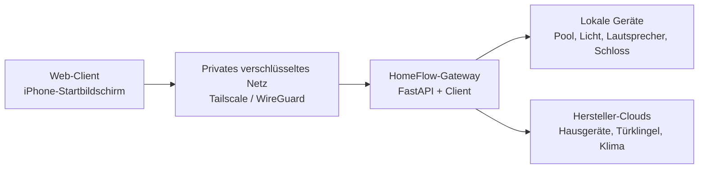
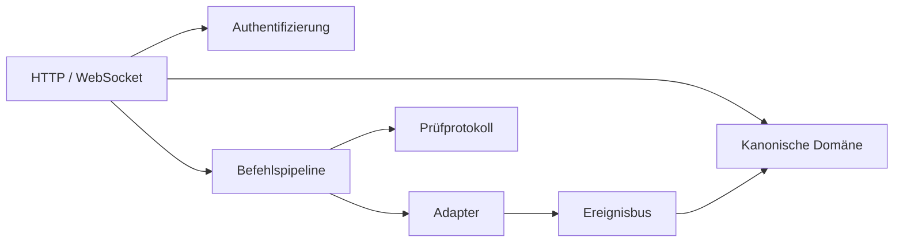
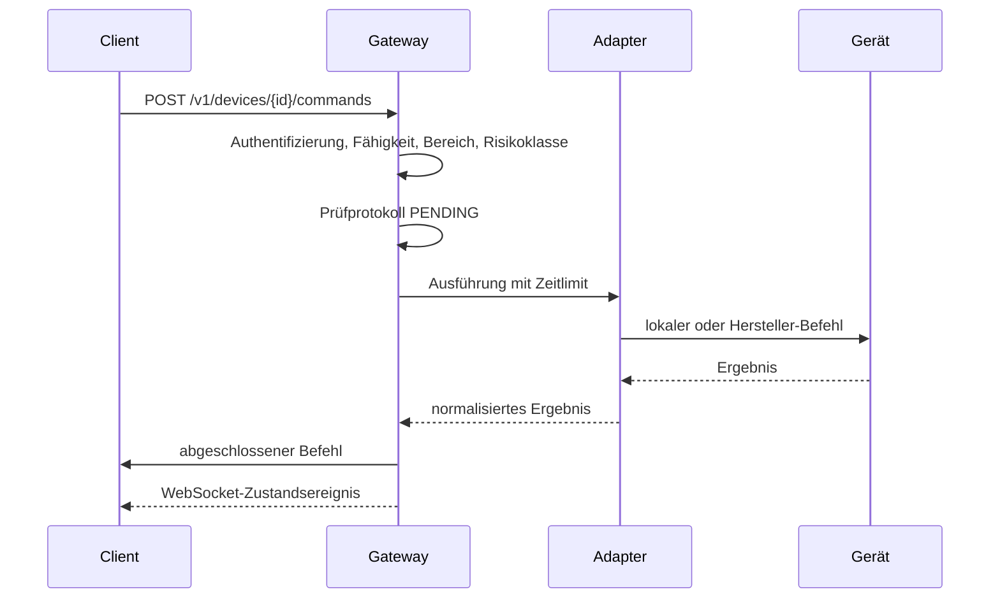

# HomeFlow

Eine zusammenhängende Oberfläche für einen Haushalt, der sich sonst auf ein
Dutzend Hersteller-Apps verteilt. HomeFlow besteht aus einem **lokal
arbeitenden Gateway** und einem installierbaren Web-Client: Das Gateway
übersetzt Philips Hue, Sonos, Nuki, Bestway AirJet, Ring, tado°, Miele und Alexa
in eine einzige kanonische API — und der Client spricht ausschließlich diese
API.

> **Dieses Repository enthält keine Haushaltsdaten.** Jedes Gerät, jeder Raum,
> jede Adresse und jede Kennung, die hier zu sehen ist, ist erfunden.
> Konfiguration, Zugangsdaten und Netzwerktopologie liegen außerhalb von Git.
> Siehe [Datenschutzmodell](docs/security/privacy-model.md).

---

## Das Problem

Ein Zuhause zu bedienen heißt derzeit, sich zu merken, welche App welches Gerät
besitzt — eine App für den Whirlpool, eine zweite für das Licht, eine dritte für
die Tür, eine vierte, um zu sehen, ob die Waschmaschine fertig ist. Jede App hat
eigene Konventionen, eigene Anmeldung und eine eigene Vorstellung davon, was
„an" bedeutet.

Das Ziel von HomeFlow ist konkret statt architektonisch:

> Der Alltag mit Whirlpool, Licht, Lautsprechern und Tür soll in einer App auf
> dem Telefon stattfinden, ohne eine Hersteller-App zu öffnen.

## Architektur

Der Client spricht nie mit einer Hersteller-API oder einem IoT-Gerät. Alles läuft
über das Gateway: Es hält die Zugangsdaten, spricht die lokalen Protokolle und
übersetzt herstellerspezifisches Verhalten in ein gemeinsames Vokabular.



Warum überhaupt ein Gateway:

- Hersteller-Zugangsdaten erreichen nie ein Telefon;
- rein lokale Protokolle bleiben im lokalen Netz;
- eine Stelle für Autorisierung, Prüfprotokoll und Ratenbegrenzung;
- eine Stelle, die entscheidet, was ein Gerät tatsächlich kann;
- ein Adapter lässt sich austauschen, ohne den Client anzufassen.

Innen ist es ein modularer Monolith — ein auslieferbarer Dienst mit klaren
inneren Grenzen, keine Microservice-Landschaft.



## Fähigkeiten statt Hersteller

Ein Gerät wird darüber beschrieben, was es tatsächlich kann. Der Client baut
seine Bedienelemente aus diesen Fähigkeiten (*capabilities*) — eine ungeprüfte
Funktion taucht schlicht nicht auf.

```json
{
  "id": "3f1c8e42-0000-4000-8000-000000000000",
  "displayName": "Demo-Pool",
  "kind": "POOL",
  "roomName": "Terrasse",
  "capabilities": ["CURRENT_TEMPERATURE", "TARGET_TEMPERATURE", "HEATING", "FILTER", "BUBBLES"],
  "state": { "currentTemperatureC": 24.5, "targetTemperatureC": 36.0, "heater": false },
  "constraints": { "targetTemperatureMinC": 20.0, "targetTemperatureMaxC": 40.0 },
  "isStale": false
}
```

Grenzwerte wie der Temperaturbereich kommen vom Adapter, der sie vom geprüften
Gerät hat — nie aus einer Annahme in der API-Schicht.

## Jede Änderung nimmt denselben Weg



Eine Zeitüberschreitung wird nie als Fehlschlag gemeldet. Ein physisches Gerät
kann handeln, nachdem das Gateway aufgehört hat zu warten — deshalb liest das
Gateway den Zustand einmal zurück und meldet `SUCCEEDED` oder `UNKNOWN`. Einen
physischen Schreibvorgang wiederholt es niemals von sich aus.

## Sicherheitsprinzipien

| Prinzip | Wie es im Code auftaucht |
| --- | --- |
| Kein öffentlicher Zugang von außen | Keine Portweiterleitung, kein Tailscale Funnel; standardmäßig nur Loopback |
| Netzwerkzugang ist keine Autorisierung | Jede `/v1`-Route löst einen registrierten Client auf |
| Fähigkeiten autorisieren Aktionen | Ein Befehl wird abgelehnt, wenn das Gerät die Fähigkeit nicht führt |
| Risikoklassen | `LOW` / `MEDIUM` / `HIGH`; Entriegeln ist immer `HIGH` |
| Hochriskante Aktionen sind gesperrt | Abgelehnt, bis die frische Geräte-Freigabe per Face ID existiert |
| Gerätegrenzen gehören dem Gerät | Sollwerte werden gegen die vom Adapter gemeldeten Grenzen geprüft |
| Alles ist begrenzt | Zeitlimits, Warteschlangen, Ratenbegrenzung, aufbewahrte Befehle |
| Fehler verraten nichts | Problemdokumente tragen Typ und Korrelations-ID, nie Interna |
| Protokolle verraten nichts | Zentrale Schwärzung von Zugangsdaten und Haushaltskennungen, per Test abgesichert |

Einzelheiten: [SECURITY.md](SECURITY.md),
[Bedrohungsmodell](docs/security/threat-model.md).

## Stand der Integrationen

| Integration | Stand | Anmerkung |
| --- | --- | --- |
| Demo (synthetisch) | Läuft | Pool, Licht, Lautsprecher, Schloss, Hausgeräte |
| Bestway AirJet | Läuft | Lokales Gizwits/GAgent-TCP; am physischen Controller verifiziert, jede Steuerung einzeln freigegeben |
| Außentemperatur | Läuft | Öffentlicher Wetterdienst, nur Koordinaten, sonst nichts |
| Home Assistant | Gebaut, unverifiziert | Vollständig gegen einen Simulator geprüft; noch an keiner echten Instanz gelaufen |
| Philips Hue | Über Home Assistant | Wartet auf eine laufende Instanz |
| Sonos | Über Home Assistant | Wartet auf eine laufende Instanz |
| tado° | Über Home Assistant | Lokaler Matter-Weg bevorzugt |
| Nuki | Geplant | Blockiert durch Client-Authentifizierung und die Hochrisiko-Freigabe |
| Miele | Geplant | Offizielle OAuth-2.0-API |
| Ring | Geplant | Zuerst Ereignisse; keine Videospeicherung |
| Alexa | Geplant | Durchsagen und ausgewählte Befehle |

Nichts gilt als „läuft", bevor es gegen das echte Gerät verifiziert wurde.

## Der Client

Eine installierbare Web-Anwendung, vom Gateway unter derselben Herkunft
ausgeliefert und auf dem iPhone-Startbildschirm abgelegt. Dieselbe Herkunft ist
der Punkt: Es gibt keine CORS-Konfiguration und damit keine
herkunftsübergreifende Angriffsfläche, und der WebSocket ist ebenfalls
gleichherkünftig.

Es sind schlichte ES-Module und handgeschriebenes CSS — kein Bundler, kein
Framework. Für eine Handvoll Bildschirme in einem Projekt, das ein Türschloss
steuert, spart das einen ganzen Abhängigkeitsbaum und erlaubt eine strenge
Content Security Policy: kein eingebettetes Skript, kein eingebetteter Stil,
keine fremde Herkunft. Ein Test setzt alle drei durch.

Was er tut:

- nach Räumen gruppierte Gerätekarten, gebaut aus **Fähigkeiten** — eine
  Steuerung, die ein Gerät nicht beherrscht, erscheint nie;
- Poolkarte mit rundem Temperaturregler zum Ziehen, Wassertemperatur in der
  Mitte, Funktionskacheln für Heizung, Filter, Düsen und Bedienfeldsperre;
- „Zuletzt gefiltert" mit Tag und Uhrzeit, und die aktuelle Außentemperatur;
- Zeitpläne: „Start in X Stunden" und „Laufzeit X Stunden", mit Countdown und
  Abbrechen;
- Karten für Licht, Lautsprecher, Thermostat, Schloss und Hausgeräte;
- Live-Aktualisierung über WebSocket, mit Wiederverbindung und ausdrücklichem
  Neuabgleich, wenn das Gateway Ereignisse verwerfen musste;
- ehrliche Zustände: offline, veraltet, in Arbeit — und `UNKNOWN` wird als
  unbekannt gezeigt, nicht als Erfolg oder Fehlschlag verkleidet;
- die Entriegeln-Schaltfläche ist sichtbar gesperrt, mit Begründung, weil das
  Gateway hochriskante Aktionen bis zur frischen Geräte-Freigabe ablehnt.

Browser können bei einem WebSocket-Handschlag keine Kopfzeilen setzen, und ein
Zugangsschlüssel darf nie in einer URL stehen. Der Client tauscht seinen
Schlüssel deshalb gegen ein **einmalig gültiges Ticket mit 30 Sekunden
Lebensdauer** und reicht es über `Sec-WebSocket-Protocol` ein.

Der Preis dafür, festgehalten in
[ADR 0011](docs/adr/0011-installable-web-client.md): keine Widgets, keine
Kontrollzentrum-Bedienelemente, keine App Intents, keine Live-Aktivitäten, kein
zuverlässiger Hintergrund-Push. Das wartet auf einen nativen Client — und der
braucht einen Mac.

## Sicher mit echter Hardware sprechen

Der Bestway-Adapter ist die erste Integration, die ein physisches Gerät berührt,
und sein Datenpunkt-Layout ist produktspezifisch und undokumentiert. An den
falschen Versatz zu schreiben ist der Weg, einem Whirlpool das Falsche zu sagen.
Das Layout gilt deshalb als Behauptung, die bewiesen werden muss:

- solange niemand die dekodierten Werte gegen das physische Bedienfeld geprüft
  hat, wird der Controller **gar nicht erst als Gerät angeboten** — eine falsche
  Temperatur erreicht nie einen Bildschirm;
- jede Steuerung wird **einzeln** freigegeben, nachdem ihre Wirkung beobachtet
  wurde;
- geschrieben wird nie blind: Es ist der Statusblock, den der Controller gerade
  gemeldet hat, mit einem geänderten Feld;
- jeder Schreibvorgang wird zurückgelesen; eine unbestätigte Änderung endet als
  `UNKNOWN`.

Beide Tore lehnen im Zweifel ab, und eine Konfiguration, die eine Steuerung ohne
geprüftes Layout freigibt, startet nicht. Das Prüfverfahren — samt einer Sonde,
die zeigt, welches Bit sich bewegt, wenn man am Pool eine Taste drückt — steht in
[docs/integrations/bestway.md](docs/integrations/bestway.md).

Der gesamte Stapel läuft auch gegen einen synthetischen Controller; damit prüft
die CI.

## Zeitpläne

Ein Zeitplan ist das Einzige in HomeFlow, das ein Gerät anfasst, während niemand
zusieht. Er ist bewusst so klein wie möglich gehalten: **eine Funktion, ein
Zeitpunkt, eine Aktion** — keine Wiederholung, keine Regelketten, keine
Automatisierungsmaschine.

- Nur Heizung und Filterpumpe dürfen auf einen Zeitplan. Eine feste Liste, keine
  Risikoklassen-Prüfung — eine Tür kann nicht auf einen Timer gelegt werden,
  egal was ein Client schickt.
- „Laufzeit" schaltet **sofort ein**, während jemand davorsteht, und legt nur das
  **Aus** auf den Timer: Die unbeaufsichtigte Hälfte reduziert, was das Gerät
  tut.
- Ein Zeitplan schaltet **genau einmal**. Ein Fehlschlag wird protokolliert und
  der Zeitplan endet; nichts wird wiederholt.
- Ausgelöst wird über dieselbe Befehlspipeline wie ein Tastendruck — dieselbe
  Prüfung der Fähigkeit, dieselben Grenzen, dasselbe Prüfprotokoll.

Begründung und Abwägungen: [ADR 0012](docs/adr/0012-one-shot-timers.md).

## Demo-Modus

Der Demo-Modus ist eine vollwertige Funktion, kein Testhilfsmittel. Er liefert
einen kompletten synthetischen Haushalt — einen Pool mit echter Aufheizkurve,
eine laufende Waschmaschine und ein absichtlich offline gehaltenes Hausgerät,
damit der Offline-Fall immer sichtbar ist. Er führt keine Ein-/Ausgabe aus und
kann kein echtes Gerät erreichen; ein Test setzt das durch.

## Gateway lokal starten

```bash
cp .env.example .env
python scripts/generate_client_token.py        # in HOMEFLOW_DEV_CLIENT_TOKEN eintragen
python scripts/generate_secret.py              # in HOMEFLOW_ID_SALT eintragen

cd backend
uv sync --extra dev
uv run python -m homeflow                      # http://127.0.0.1:8000
```

`http://127.0.0.1:8000` öffnen und den Zugangsschlüssel einfügen. Das Gateway
liefert API und Client aus.

```bash
curl -H "Authorization: Bearer $HOMEFLOW_DEV_CLIENT_TOKEN" \
     http://127.0.0.1:8000/v1/devices
```

Für Dauerbetrieb und Telefonzugriff über ein privates Netz:
[docs/runbooks/remote-access.md](docs/runbooks/remote-access.md).
Für Home Assistant: [docs/runbooks/home-assistant.md](docs/runbooks/home-assistant.md).

Qualitätsprüfungen:

```bash
uv run ruff check . && uv run ruff format --check .
uv run pyright
uv run pytest
```

## API

```text
GET    /v1/me
GET    /v1/rooms
GET    /v1/devices
GET    /v1/devices/{id}
POST   /v1/devices/{id}/commands
GET    /v1/devices/{id}/schedules
POST   /v1/devices/{id}/schedules
DELETE /v1/schedules/{id}
GET    /v1/commands/{id}
GET    /v1/activity
POST   /v1/auth/ws-ticket
WS     /v1/ws
```

Eine Route, die Hersteller-Aufrufe durchreicht, gibt es bewusst nicht. Das
Gateway bietet ausschließlich semantische Aktionen an.

## Fahrplan

| Phase | Ziel | Stand |
| --- | --- | --- |
| 0 | Sicheres Projektfundament | Fertig |
| 1 | Synthetische Strecke von Ende zu Ende (Demo-Pool), Gateway und Client | Fertig |
| 2 | Bestway AirJet, nur lesend | Fertig, am physischen Controller verifiziert |
| 3 | Bestway-Steuerung, Fähigkeit für Fähigkeit | Fertig: Düsen, Filter, Heizung, Sollwert, Bedienfeldsperre |
| 4 | Home-Assistant-Adapter | Gebaut und gegen Simulator geprüft; wartet auf eine echte Instanz |
| 5 | Hue und Sonos | Kommt mit Phase 4 ins Haus |
| 6 | Nuki, nach Client-Authentifizierung und Sicherheitsprüfung | |
| 7–12 | tado°, Miele, Ring, Alexa, Bedienkomfort, Auswertungen | |

Offene Grundlagen, die keiner Phase gehören: Dauerbetrieb auf einem eigenen
Rechner (Zeitpläne und Fernzugriff sterben sonst mit dem Laptop) und
Persistenz — Aktivitätsprotokoll und Zeitpläne überleben derzeit keinen
Neustart.

## Verzeichnisse

```text
apps/web/         installierbarer Web-Client, vom Gateway ausgeliefert
backend/          FastAPI-Gateway, Adapter, Tests
docs/             Architektur, ADRs, Sicherheit und Datenschutz
infrastructure/   Container- und Deployment-Material
scripts/          lokale Hilfsskripte
```

## Lizenz

MIT — siehe [LICENSE](LICENSE).
