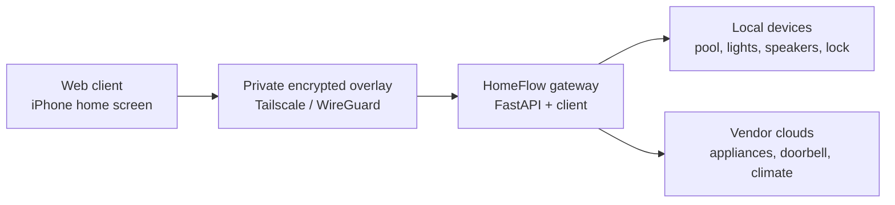
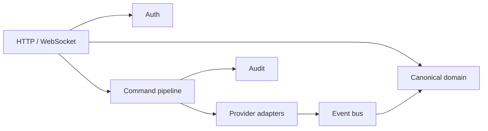
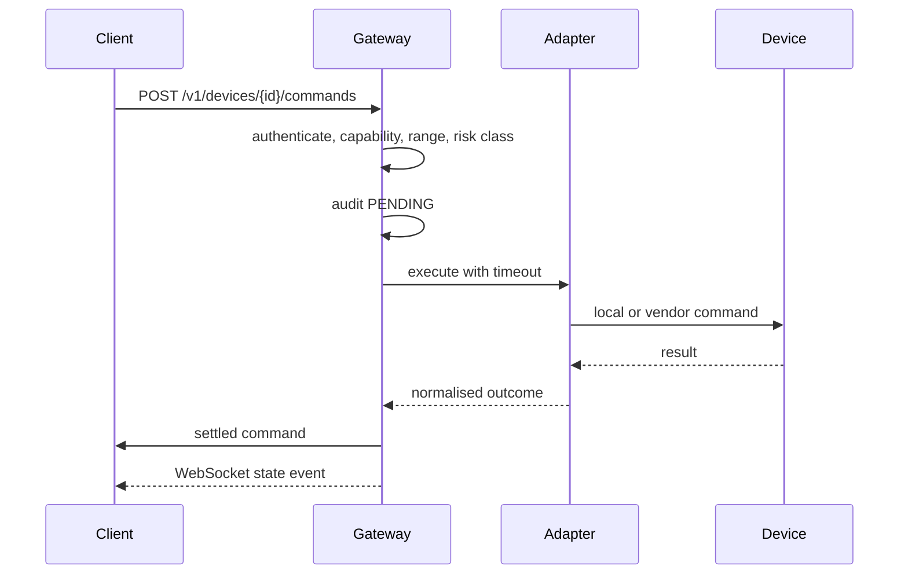

# HomeFlow

One coherent interface for a household that is spread across a dozen vendor
apps. HomeFlow is a **local-first home gateway** plus an installable web client:
the gateway normalises Philips Hue, Sonos, Nuki, Bestway AirJet, Ring, tado°,
Miele and Alexa into a single canonical API, and the client only ever speaks
that API.

> **This repository contains no household data.** Every device, room, address and
> identifier you can see here is synthetic. Configuration, credentials and
> network topology live outside Git. See [Privacy model](docs/security/privacy-model.md).

---

## The problem

Controlling one home currently means remembering which app owns which device —
one app to warm the hot tub, another for the lights, a third for the door, a
fourth to see whether the washing machine is done. Each app has its own
conventions, its own login and its own idea of what "on" means.

HomeFlow's goal is concrete rather than architectural:

> Everyday use of the Bestway AirJet, the lights, the speakers and the door
> should happen in one app, on a phone, without opening a vendor app.

## Architecture

The client never talks to a vendor API or an IoT device. Everything goes through
the gateway, which holds the credentials, speaks the local protocols and turns
vendor-specific behaviour into one vocabulary.



Why a gateway at all:

- vendor credentials never reach a phone;
- local-only protocols stay on the local network;
- one place for authorisation, audit and rate limiting;
- one place that decides what a device can actually do;
- an adapter can be replaced without touching the client.

Inside, it is a modular monolith — one deployable service with firm internal
boundaries, not a microservice constellation.



## Capabilities, not vendors

A device is described by what it can actually do. The client renders controls
from capabilities, so an unverified feature simply does not appear.

```json
{
  "id": "3f1c8e42-0000-4000-8000-000000000000",
  "displayName": "Demo Pool",
  "kind": "POOL",
  "roomName": "Terrace",
  "capabilities": ["CURRENT_TEMPERATURE", "TARGET_TEMPERATURE", "HEATING", "FILTER", "BUBBLES"],
  "state": { "currentTemperatureC": 24.5, "targetTemperatureC": 36.0, "heater": false },
  "constraints": { "targetTemperatureMinC": 20.0, "targetTemperatureMaxC": 40.0 },
  "isStale": false
}
```

Capability limits such as the temperature range come from the adapter, which
gets them from the verified device — never from a guess in the API layer.

## Every mutation takes the same path



A timeout is never reported as a failure. A physical device can act after the
gateway stopped waiting, so the gateway reads state back once and reports
`SUCCEEDED` or `UNKNOWN` — it never repeats a physical write on its own.

## Security principles

| Principle | How it shows up in the code |
| --- | --- |
| No public ingress | No port-forward, no Tailscale Funnel; loopback binding by default |
| Network access is not authorisation | Every `/v1` route resolves a registered client |
| Capabilities authorise actions | A command is refused unless the device declares the capability |
| Risk classes | `LOW` / `MEDIUM` / `HIGH`; unlocking is always `HIGH` |
| High-risk actions are gated | Refused until the fresh device-owner authorisation flow exists |
| Device limits are the device's | Setpoints are checked against adapter-declared constraints |
| Bounded everything | Timeouts, queues, rate limits, retained commands |
| Nothing leaks in errors | Problem details carry a stable type and a correlation id, never internals |
| Nothing leaks in logs | Central redaction of credentials and household identifiers, unit-tested |

Details: [SECURITY.md](SECURITY.md), [threat model](docs/security/threat-model.md).

## Integration status

| Integration | Status | Notes |
| --- | --- | --- |
| Demo (synthetic) | Working | Pool, lights, speaker, lock, appliances |
| Bestway AirJet | Planned | Local Gizwits/GAgent TCP, read-only first |
| Home Assistant | Planned | REST plus WebSocket, as an integration gateway |
| Philips Hue | Planned | Via Home Assistant |
| Sonos | Planned | Via Home Assistant |
| Nuki | Planned | Blocked on client authentication and the high-risk flow |
| tado° | Planned | Local Matter path preferred |
| Miele | Planned | Official OAuth 2.0 third-party API |
| Ring | Planned | Events first; no video retention |
| Alexa | Planned | Announcements and selected commands |

Nothing is marked working until it has been verified against the real device.

## The client

An installable web application, served by the gateway on the same origin, added
to the iPhone home screen. Same-origin serving is the point: there is no CORS
configuration and therefore no cross-origin surface, and the WebSocket is
same-origin too.

It is plain ES modules and hand-written CSS — no bundler, no framework. For a
handful of screens on a project that controls a door lock, that removes an
entire dependency tree and lets the Content Security Policy stay strict: no
inline script, no inline style, no external origin. A unit test enforces all
three.

What it does:

- room-grouped device cards built from **capabilities**, so a control a device
  cannot perform never appears;
- pool card with the live water temperature, a setpoint slider bounded by the
  device's own limits, and heater, filter, bubbles and panel-lock switches;
- light, speaker, lock and appliance cards;
- live updates over the WebSocket, with reconnect and an explicit resync when
  the gateway had to drop events;
- honest states: offline, stale, pending — and `UNKNOWN` shown as unknown
  rather than dressed up as success or failure;
- the unlock control is visibly disabled with the reason, because the gateway
  refuses high-risk actions until fresh device-owner authorisation exists.

Browsers cannot set headers on a WebSocket handshake and a credential must never
sit in a URL, so the client exchanges its credential for a **single-use ticket
valid 30 seconds** and presents it through `Sec-WebSocket-Protocol`.

The trade-off, recorded in [ADR 0011](docs/adr/0011-installable-web-client.md):
no widgets, Control Center controls, App Intents, Live Activities or reliable
background push. Those wait for a native client, which needs a Mac.

## Demo mode

Demo mode is a first-class feature, not a test fixture. It serves a complete
synthetic household — a pool with a real heating curve, a running washing
machine, and one deliberately offline appliance so that offline handling is
always visible. It performs no I/O and cannot reach a real device; a unit test
enforces that.

## Running the gateway locally

```bash
cp .env.example .env
python scripts/generate_client_token.py        # paste into HOMEFLOW_DEV_CLIENT_TOKEN
python scripts/generate_secret.py              # paste into HOMEFLOW_ID_SALT

cd backend
uv sync --extra dev
uv run python -m homeflow                      # http://127.0.0.1:8000
```

Open `http://127.0.0.1:8000` and paste the access token. The gateway serves both
the API and the client.

```bash
curl -H "Authorization: Bearer $HOMEFLOW_DEV_CLIENT_TOKEN" \
     http://127.0.0.1:8000/v1/devices
```

Quality gates:

```bash
uv run ruff check . && uv run ruff format --check .
uv run pyright
uv run pytest
```

## API

```text
GET  /v1/me
GET  /v1/rooms
GET  /v1/devices
GET  /v1/devices/{id}
POST /v1/devices/{id}/commands
GET  /v1/commands/{id}
GET  /v1/activity
WS   /v1/ws
```

There is deliberately no provider passthrough route. The gateway exposes
semantic actions only.

## Roadmap

| Phase | Goal | State |
| --- | --- | --- |
| 0 | Safe project foundation | Done |
| 1 | End-to-end synthetic slice (Demo Pool), gateway and client | Done |
| 2 | Bestway AirJet, read-only | Next |
| 3 | Bestway control, capability by capability | |
| 4 | Home Assistant adapter | |
| 5 | Hue and Sonos | |
| 6 | Nuki, after client authentication and a security review | |
| 7–12 | tado°, Miele, Ring, Alexa, usability, analytics | |

## Repository layout

```text
apps/web/    installable web client, served by the gateway
backend/     FastAPI gateway, adapters, tests
docs/        architecture, ADRs, security and privacy documentation
infrastructure/  container and deployment material
scripts/     local helper scripts
```

## License

MIT — see [LICENSE](LICENSE).
