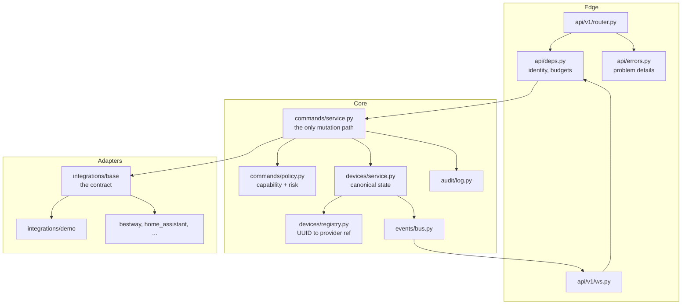
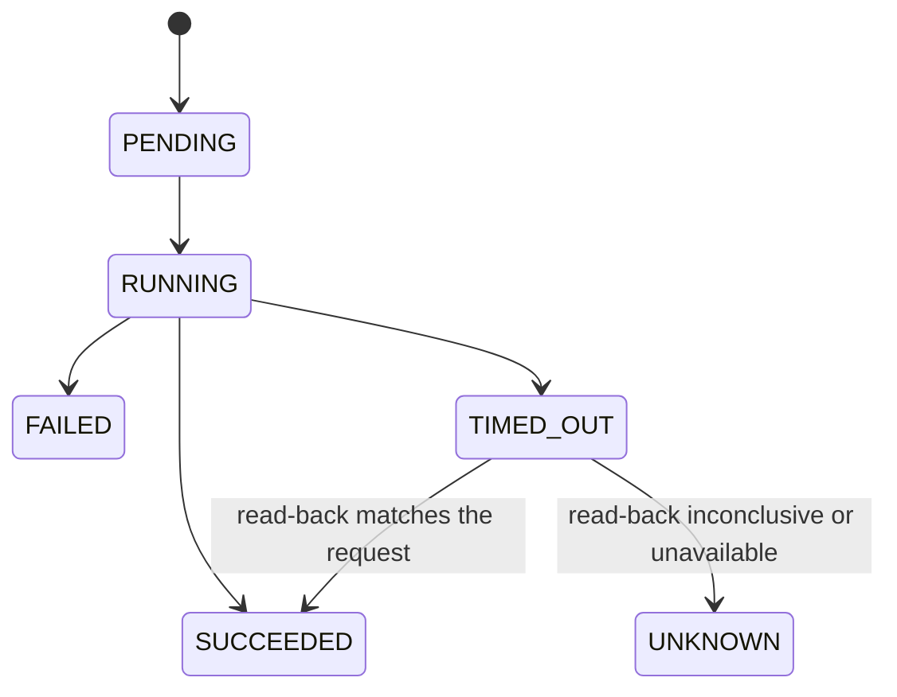
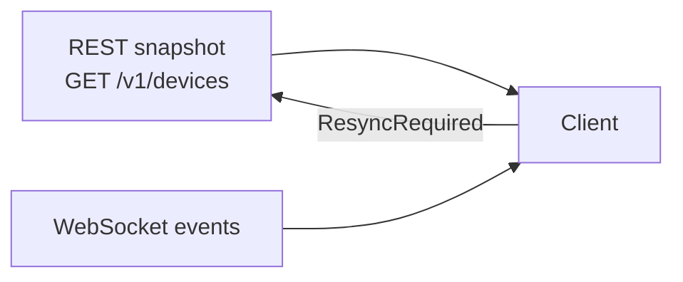

# Gateway architecture

How the backend is put together and why each seam exists. The product-level view
lives in the repository `README.md`.

## Module map



Three rules keep the seams meaningful:

1. `devices/models.py` imports nothing from `integrations`. A domain object
   therefore cannot carry a provider identifier.
2. Only `devices/registry.py` knows the mapping from a HomeFlow UUID to a
   provider reference.
3. Only `commands/service.py` calls an adapter's `execute`.

## Command lifecycle



`UNKNOWN` is the important state. A hot tub controller can act three seconds
after the gateway gave up waiting, so reporting a timeout as a failure would be
a lie that a client would show to a person. After a timeout the gateway reads
state back exactly once, within its own bounded budget, and never repeats the
write.

The submit path, in order:

1. resolve the device (404 if unknown);
2. validate parameters against the action's schema (422);
3. check the required capability — `UNLOCK` for unlocking, not `LOCK` (422);
4. check the value against adapter-declared constraints (422);
5. classify risk; refuse `HIGH` until fresh device-owner authorisation exists (403);
6. refuse writes to an offline device (409);
7. record the request in the audit trail;
8. execute under a timeout, serialised per device;
9. settle the status, audit it and publish the events.

Steps 1 to 6 happen before any adapter is touched, so a rejected command never
reaches a physical device — which the tests assert by counting adapter calls.

## State freshness

Physical state is authoritative; the gateway holds a view of it and always says
how old that view is.



Every device carries `stateObservedAt`, `lastSeenAt`, `availability` and a
computed `isStale`. Timestamps only advance while a device is reachable, so an
offline device keeps showing when its state was last genuinely observed instead
of appearing freshly confirmed.

If a client is too slow and its bounded event queue overflows, the gateway drops
the oldest events, flags the subscription and sends a `ResyncRequired` frame.
The client refetches the snapshot. Silent divergence is not an option.

## Adapters

```python
class DeviceProvider(Protocol):
    async def discover_devices(self) -> Sequence[ProviderDevice]: ...
    async def get_state(self, device_ref: ProviderDeviceRef) -> ProviderState: ...
    async def execute(self, device_ref, command) -> ProviderCommandResult: ...
    def subscribe(self) -> AsyncIterator[ProviderEvent]: ...
```

An adapter that cannot subscribe polls internally and still yields events;
nothing above the adapter knows the difference. Each adapter stream runs in its
own supervised task, restarted with capped exponential backoff and jitter, so a
failing vendor cloud cannot stop pool control.

An adapter declares its own `DeviceConstraints`. That is what allows the command
service to validate a setpoint without hard-coding a limit for hardware it has
never seen.

## Identifiers

```text
device_id = UUID(HMAC-SHA256(id_salt, "device\0<provider>\0<provider_device_id>")[:16])
```

Stable across restarts without a database, and not reversible by a reader of
this repository: a plain hash would be brute-forceable because provider ids are
low entropy. Demo mode uses a fixed public salt so demo identifiers are
reproducible in fixtures and screenshots.

## Configuration

`Settings` validates at startup and refuses to run rather than warning. A
production configuration that enables demo mode, carries a development
credential, allows a wildcard `Host` or omits the identifier salt does not
start.

## What is not here yet

- persistence — see [ADR 0009](../adr/0009-deferred-persistence.md);
- client registration and the fresh action-authorisation flow;
- real adapters, starting with read-only Bestway in phase 2;
- metrics and tracing, which come after the first real adapter.
