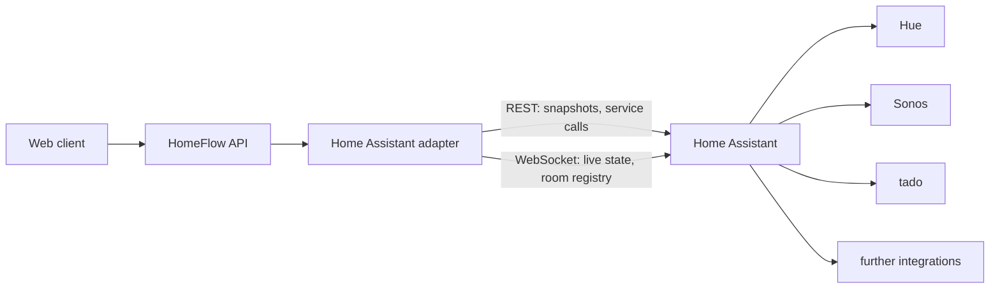

# Home Assistant

The adapter that turns one Home Assistant instance into canonical HomeFlow
devices. Setting Home Assistant up is a separate document:
[runbooks/home-assistant.md](../runbooks/home-assistant.md).

## Shape

Both interfaces are official and each is used for what it is good at: REST for
the snapshot and for service calls, whose response says which entities actually
changed; the WebSocket API for live updates and for the area registry, which is
the only place the room assignment lives.

## The three gates on writing

An action has to pass all three before anything moves:

1. **The entity says it can.** Capabilities come from what Home Assistant
   advertises for that entity. A lamp that cannot dim never claims brightness.
2. **The operator released the domain.** `HOMEFLOW_HOME_ASSISTANT_WRITE_ENABLED`
   names domains, empty by default. An unreleased domain is advertised without
   its writable capabilities, so the command pipeline refuses the action.
3. **The adapter checks again.** `execute` re-checks the release before calling
   a service, so weakening the pipeline is not enough to make a device move.

`lock` sits outside all of this: it is not in `RELEASABLE_DOMAINS`, naming it in
configuration fails startup, and the mapping gives a door no writable capability
at all. Three separate places would have to be changed to open a door, which is
the point.

## Read-back

Home Assistant returning `200` means it accepted the call, not that the device
did anything — an integration can fail quietly behind it. So every write is
followed by a read:

1. The service response often already carries the new state. If it reads
   correctly, the command is done.
2. Otherwise the entity is read again, a few times, briefly.
3. If it never reads correctly, the command settles as `UNKNOWN` with
   `not_confirmed_by_device` — never as success.

Reading is idempotent and safe to repeat. The service call is not, and is never
repeated.

## Live state

The event stream opens with a full snapshot and then follows `state_changed`.
That matters on reconnect: events were missed while the socket was down, so
starting from a snapshot is what stops held state from drifting quietly. If the
socket fails, the gateway restarts it with capped backoff and the state simply
goes stale in the ordinary way.

## Privacy

`light.wohnzimmer_stehlampe` says which vendor is installed and which rooms
exist; a friendly name may well be a person's. Both are household data.

- Entity ids stay in the provider reference. The registry turns them into keyed
  HMAC identifiers, and no client ever sees the original.
- `entity_id` and `provider_device_id` are in the log redaction key list, so an
  entity id cannot reach a log line even by accident.
- Neither the address nor the token is logged, at any level.
- Friendly names are shown to the household and never logged or committed.
- Test fixtures are invented. Nothing captured from a real instance is committed
  (see [privacy-model.md](../security/privacy-model.md)).

## Known limitations

- **Long-lived tokens are not scoped.** Home Assistant has no per-entity
  permission model, so a non-administrator token still sees every entity that
  user sees. Documented rather than worked around.
- **No colour.** On/off and brightness only.
- **No grouping**, no scenes, no doorbell or motion events yet.
- **Entities added after discovery** are not picked up until the gateway
  restarts.
- **`https` with a self-signed certificate will fail.** Certificate validation
  is not bypassed, deliberately. Use plain HTTP on the local network, or a
  certificate the host actually trusts.

## Testing

There is no Home Assistant in CI and there never will be. The adapter is
exercised against `tests/simulators/home_assistant.py`, which answers REST
through an httpx transport and runs a **real** WebSocket server on loopback —
real because the authentication handshake is the part most worth testing, and a
mocked socket would only test the mock.
