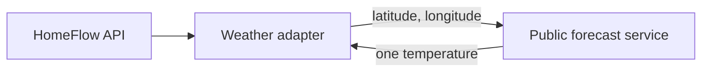

# Outdoor temperature

Heating a tub to 36 °C means something different at 4 °C outside than at 24 °C.
This adapter fetches one number so the pool card can be read in context.

It is the only part of HomeFlow that reaches a service outside the household, so
it is off by default and deliberately small.

## What it is

A read-only `SENSOR` device with a single capability, `CURRENT_TEMPERATURE`.
Nothing above the adapter knows a weather service exists; a command sent to it
is refused, because a thermometer is not a control surface.



## What it sends

A latitude, a longitude, and the name of the field being asked for. Nothing
else — no device state, no identifiers, no household data. There is a test that
fails if that ever stops being true.

## What it accepts back

The response is untrusted input like any other provider payload:

- the shape is validated, and anything unexpected is a `ProviderUnavailableError`
  rather than a value;
- a temperature outside −90 °C to 60 °C is treated as a broken response, not as
  weather;
- the service's own error text is never repeated into a problem document.

A failure leaves the last reading in place, marked stale by the ordinary
freshness rules. It never blocks the pool.

## Rate and quota

One request every 15 minutes by default. On failure the adapter backs off
exponentially with jitter, up to an hour, and resets once a reading succeeds. A
forecast is not worth hammering for.

## Configuration

```dotenv
HOMEFLOW_WEATHER_ENABLED=true
HOMEFLOW_WEATHER_LATITUDE=52.5200
HOMEFLOW_WEATHER_LONGITUDE=13.4050
HOMEFLOW_WEATHER_DISPLAY_NAME=Aussentemperatur
HOMEFLOW_WEATHER_POLL_SECONDS=900
```

Startup fails if the feature is enabled without coordinates, rather than quietly
falling back to somewhere.

## Privacy

**The coordinates say where someone lives.** They belong in the untracked `.env`
and never in this repository, an issue, a screenshot or a log line. The gateway
logs that a weather provider was configured; it does not log where.

Use the centre of a district or postcode area rather than a street address. The
weather is identical and the value reveals less. The example above is a public
square in Berlin, not anybody's home.
