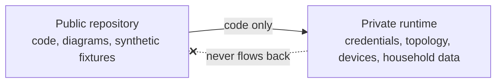

# Privacy model

HomeFlow is developed in public and runs in a private home. This document
describes the boundary between the two and how it is enforced.

Assume every committed file is read by strangers, every commit is scanned by
bots, screenshots are indexed, and Git history is permanent. When it is unclear
whether something is sensitive, it is sensitive.

## Never committed

Addresses and network: public IP, LAN inventory, Wi-Fi SSID or password, BSSID,
MAC addresses, internal DNS names, Tailscale tailnet name, MagicDNS hostname,
auth key or node key.

Device and account identifiers: device UIDs, serial numbers, Nuki lock ids or
tokens, Home Assistant tokens, Home Assistant entity ids that reveal real rooms
or people, Ring account or device identifiers, Ring video URLs or tokens, Miele
appliance ids, Miele client secret or tokens, tado° home and zone ids, Amazon
account identifiers, Alexa device serials, Bestway identifiers tied to the
household, APNs keys.

People and behaviour: resident names, email addresses, unusually identifying
room names, presence history, door-access history, camera thumbnails, real
screenshots, production database dumps and raw production provider payloads.

This applies to **all history**, not only the current commit.

## Synthetic values used instead

| Kind | Value used in this repository |
| --- | --- |
| People | Alice, Bob |
| Rooms | Living Room, Kitchen, Terrace, Hallway, Utility Room |
| Devices | Ceiling Light, Speaker, Demo Lock, Demo Pool, Demo Washer, Demo Dishwasher |
| IPv4 | 192.0.2.10, 198.51.100.20, 203.0.113.30 (RFC 5737) |
| MAC | 02:00:00:00:00:01 (locally administered) |
| Host | homeflow.example.internal |

A production value with one character changed is not a synthetic value.

## How the boundary is enforced

**Structurally.** Public device identifiers are derived from a deployment secret
with a keyed HMAC, so a reader of this repository cannot reverse an id to a
provider entity id — and a low-entropy provider id cannot be brute-forced
either. API response models are built field by field from domain objects and
never carry a provider reference. An integration test serialises the whole
device list and asserts that no provider identifier appears in it.

**In logging.** A central redaction layer removes sensitive keys and scrubs
credentials, MAC addresses, JWT-shaped tokens, Tailscale keys and IP literals
from free text. Where an identifier is genuinely needed for correlation, a
one-way per-process pseudonym is used. Redaction is unit-tested.

**In tooling.** `.gitignore` excludes `.env`, captures, dumps, backups, keys and
screenshots. gitleaks runs in CI and as a pre-commit hook with additional rules
for Home Assistant tokens, Tailscale keys, APNs key material, MAC addresses and
private LAN ranges.

**In demo mode.** Screenshots and recordings come from a synthetic household.
The demo provider performs no I/O and imports no other adapter, which a unit
test enforces, so demo material cannot accidentally contain real state.

## Screenshots

Use demo mode. Before committing an image, check device names, room names, user
names, timestamps that reveal routines, camera content, addresses and hostnames,
device identifiers, notification text and location indicators.

## Diagrams

Diagrams show logical architecture. No diagram may contain a real hostname, a
real address, a real device identifier or the actual network topology of the
house.

## Data collected at runtime

| Data | Retention intent |
| --- | --- |
| Security audit | Long enough to investigate an incident |
| Device telemetry | Configurable; downsampled and expired |
| Camera and video | Not persisted |
| Debug provider payloads | Temporary and sanitized only |
| Presence | Not collected without an explicit decision, and only at household granularity |

Data is collected to answer a question a resident actually has, not because a
provider exposes it.

## Certificate transparency

Enabling HTTPS certificates on a private overlay can publish the hostname to
public certificate transparency logs. Node and host names must therefore not
encode resident names or the address, and real hostnames are never documented
here.
