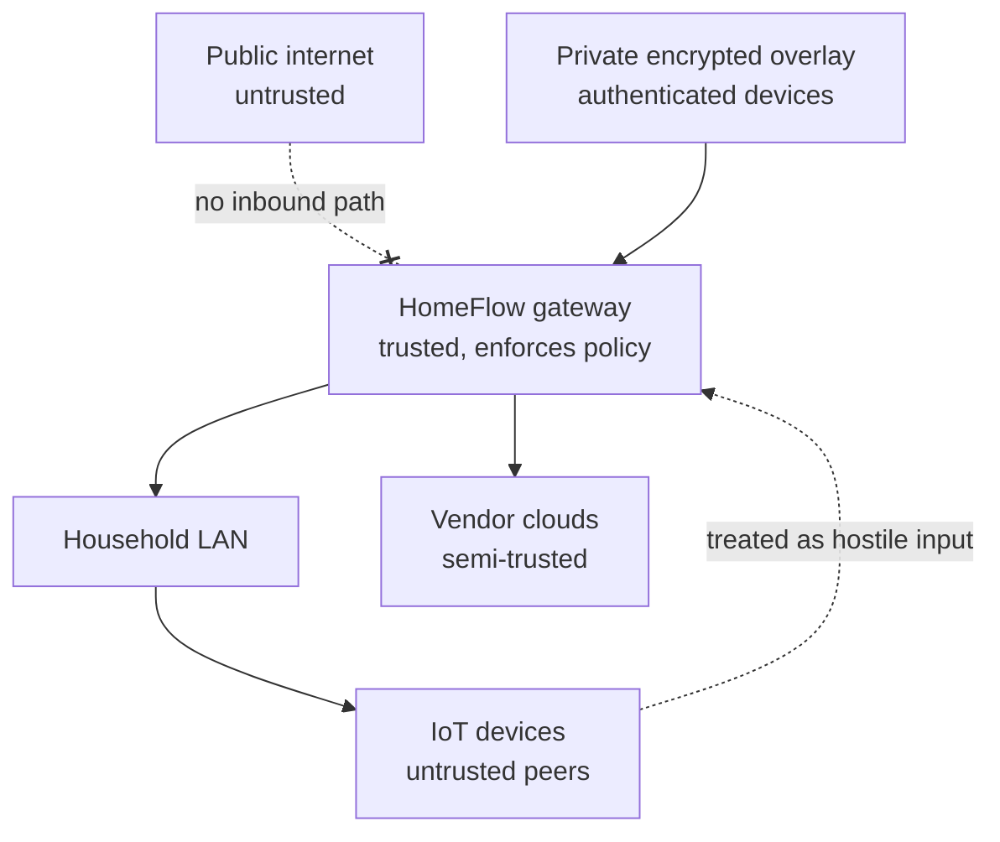

# Threat model

Scope: the HomeFlow gateway, its adapters and the client protocol. Everything in
this document uses synthetic examples.

## What is being protected

| Asset | Why it matters |
| --- | --- |
| Door lock control | Physical access to the home |
| Vendor credentials and tokens | Full control of accounts and devices |
| Household topology and device inventory | Reveals attack surface and routines |
| Camera and doorbell data | Highly sensitive personal data |
| Presence and activity history | Reveals when the home is empty |
| Pool and appliance control | Safety, energy cost, water damage |
| Gateway host | Pivot into the whole home network |

## Trust boundaries

The important boundary is not the LAN edge. **IoT devices and vendor responses
are untrusted input even when they arrive from inside the house**, because IoT
firmware is rarely maintained and a single compromised device would otherwise
become a control channel.

## Adversaries

| Adversary | Capability | Primary mitigation |
| --- | --- | --- |
| Opportunistic internet scanner | Scans public IPs and common ports | No public ingress at all |
| Targeted attacker who read this repository | Knows the design and endpoints | Design carries no secrets; identifiers are keyed |
| Credential-stuffing bot | Reused vendor passwords | Vendor MFA; gateway holds tokens, not passwords |
| Compromised GitHub account | Can push code | Production deployment is a separate trusted action; CI has no household access |
| Stolen unlocked phone | Holds a client credential | Per-client revocation; high-risk actions need device-owner authorisation |
| Malicious app on a household phone | Can read app storage | Credentials in platform keystore; future device-bound key pair |
| Compromised IoT device | Sends arbitrary local traffic | Only the gateway speaks to devices; frames are validated and bounded |
| Malicious LAN client | Can reach the gateway port | Application authentication; `Host` allowlist; rate limits |
| Vendor cloud compromise | Returns hostile payloads | Typed adapter models; validation; no raw payload passthrough |
| Leaked access token | Full API access until noticed | Short-lived sessions and revocation (registration flow pending) |
| Developer mistake | Commits a secret or a real identifier | gitleaks in CI and pre-commit; redaction tests; synthetic-only fixtures |

## Attacks and controls

### Public exposure

A port-forward, UPnP mapping or Funnel would expose door control to the
internet. **Control:** no public ingress is part of the design; the API binds to
loopback by default; deployment documentation uses the private overlay only.
Enabling any public exposure requires explicit human approval.

### DNS rebinding and browser-driven requests

A browser on the household network could be steered into issuing requests to the
gateway. **Control:** a `Host` allowlist (wildcards refused in production), no
CORS middleware, no cookie-based authentication — a bearer credential the
browser does not hold — plus `X-Frame-Options` and `nosniff`.

### Replayed or repeated commands

**Control:** desired-state semantics rather than toggles, so a repeat is
idempotent; per-device serialisation so a device never sees overlapping writes;
per-client rate limiting; and no automatic retry after an unknown outcome. Anti-
replay for high-risk actions arrives with the action-authorisation flow.

### SSRF through provider configuration

An attacker who could supply a provider base URL would turn the gateway into a
proxy into the LAN and into cloud metadata services. **Control:** provider
endpoints are administrator configuration only. No API accepts a URL.

### Malformed IoT payloads

**Control:** typed adapter models, explicit frame-size and type validation in
local protocol adapters, bounded reads and mandatory timeouts. An adapter
failure is contained: the supervisor restarts that stream with capped backoff
while the rest of the gateway keeps running.

### Information disclosure through errors and logs

**Control:** problem details expose a stable type, an authored message and a
correlation id — never a stack trace, a provider body, a hostname or an internal
id. All log fields pass through central redaction, unit-tested against tokens,
MAC addresses, IP literals and provider entity ids.

### Compromised CI

A workflow with household access would hand the home to anyone who can open a
pull request. **Control:** CI runs synthetic tests only, has read-only
permissions, and holds no vendor, Tailscale or APNs credentials. **A
self-hosted runner must never be attached to pull-request workflows.**

### Physical safety

**Control:** setpoints validated against verified device limits; hardware
interlocks mirrored rather than bypassed; no writes to an unverified datapoint
layout; read-only verification precedes the first write for every capability.

## Accepted risks

| Risk | Why accepted | Revisit when |
| --- | --- | --- |
| No IoT VLAN | Current router may not support it; application controls do not depend on it | Network hardware changes |
| Audit is not durable | Phase 1 has no database; the alternative was shipping untested persistence | Phase 2 |
| Single development credential | Registration flow is deliberately deferred to the phase that needs it | Before Nuki |
| Home Assistant token is broad | Home Assistant offers limited least-privilege options | If Home Assistant gains scoped tokens |
| Plaintext local device protocols | Gizwits/GAgent has no modern transport security | Segment the IoT network |
